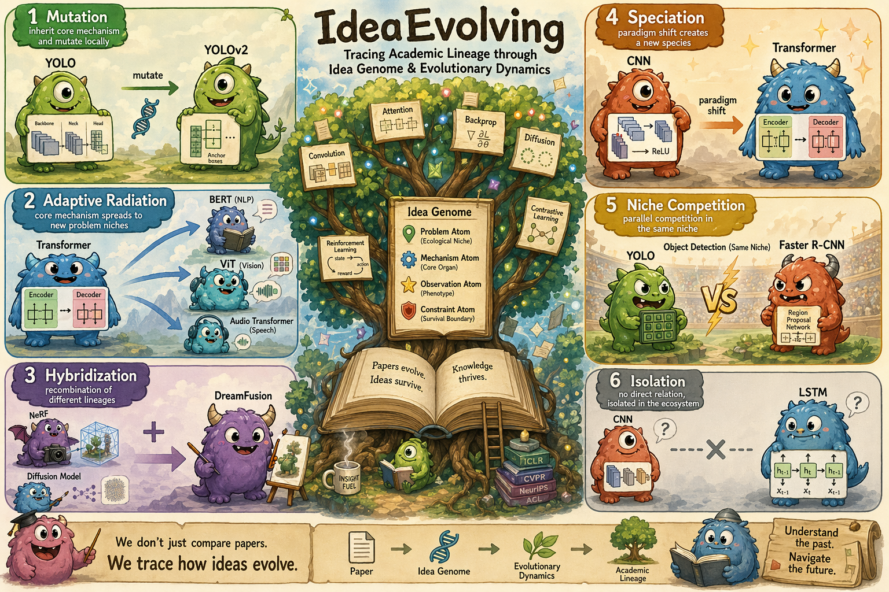

# Ideas Have Genomes

**Scientific ideas are not isolated papers. They have genomes.**

IdeaGene-Bench (IG-Bench) evaluates scientific lineage reasoning and lineage-grounded idea generation for AI scientists.

<p align="center">
  <a href="https://visionxlab.github.io/IdeasHaveGenomes/">Project Page</a> |
  <a href="https://arxiv.org/abs/2607.08758">Paper</a> |
  <a href="https://huggingface.co/papers/2607.08758">Hugging Face</a> |
  <a href="https://discord.gg/SrAvenJgg">Discord</a>
</p>

<p align="center">
  
</p>

## Overview

The bottleneck of Auto Research is not only whether an AI scientist can write a plausible proposal. The harder question is whether it can understand where an idea comes from, how it evolves, and why it is worth pursuing.

Ideas Have Genomes treats scientific ideas as lineage-structured objects. An idea can inherit mechanisms, repair limitations, recombine with other lineages, and radiate into new problem niches. This genome-centric view lets us evaluate whether AI systems understand the evolution of ideas rather than only retrieving related papers.

## IdeaGene-Bench

IdeaGene-Bench (IG-Bench) is built around two complementary evaluation tracks:

- **IG-Exam**: 42 task types and 1,029 closed-form instances for Idea Genome abstraction, inheritance tracing, evolutionary reasoning, and lineage verification.
- **IG-Arena**: lineage-grounded idea generation evaluated by Population-Evolution Score (PES), which measures Heredity, Variation, and Selection.

| Item | Count |
|---|---:|
| Golden lineage traces | 1,961 |
| Idea Genome objects | 1,085 |
| GenomeDiff records | 920 |
| Scientific domains | 10 |
| IG-Exam task types | 42 |
| IG-Exam instances | 1,029 |

## Quickstart

### Install

```bash
pip install -r requirements.txt
```

### Set API Credentials

The examples below use an OpenAI-compatible API endpoint.

```bash
export BASE_URL="https://api.openai.com/v1"
export API_KEY="sk-your-key-here"
export MODEL_NAME="gpt-4o"
```

### Run IG-Exam

```bash
# Smoke test: one task type, two instances.
python -m gene_exam.evaluators.eval_benchmark \
  --provider openai \
  --model gpt-4.1-mini \
  --task-type T1-01_contribution_type \
  --max-per-task 2 \
  --output gene_exam/results/smoke.json

# Full 42-task benchmark.
python -m gene_exam.evaluators.eval_benchmark \
  --provider openai \
  --model gpt-4.1-mini \
  --concurrency 8 \
  --output gene_exam/results/eval_full.json
```

### Run IG-Arena PES

Place generated proposals at:

```text
gene_arena/results/<arena-id>/ideas/<task_id>/<participant_id>_<setting>.json
```

Each file should contain:

```json
{
  "content": "... generated proposal text or JSON ..."
}
```

Then score with PES:

```bash
python gene_arena/run_arena.py pes \
  --arena-id smoke \
  --tasks cs_AgentFramework \
  --participants openai-default \
  --settings Question \
  --judge-models judge-gpt4o judge-gpt4o-mini judge-gpt4.1-mini
```

Results are written to:

```text
gene_arena/results/<arena-id>/
```

## Repository Structure

```text
IdeasHaveGenomes/
|-- gene_exam/      # IG-Exam tasks and exact-match evaluator
|-- gene_arena/     # IG-Arena tasks and PES scorer
|-- docs/           # Project page and visual assets
|-- config.py
`-- requirements.txt
```

## Community

Join our Discord for updates, discussions, and future releases:

https://discord.gg/SrAvenJgg

WeChat group:

<p align="center">
  
</p>

If the QR code expires, please join the Discord or open an issue.

## Citation

```bibtex
@misc{zhou2026ideashavegenomes,
  title={Ideas Have Genomes: Benchmarking Scientific Lineage Reasoning and Lineage-Grounded Idea Generation},
  author={Yifan Zhou and Qihao Yang and Yan Li and Donggang Li and Xiru Hu and Hokin Deng and Ziyang Gong and Xuanyi Zhou and Huacan Wang and Xiangchao Yan and Wanghan Xu and Wenlong Zhang and Shaofeng Zhang and Yue Zhou and Yifan Yang and Zhihang Zhong and Xue Yang},
  year={2026},
  eprint={2607.08758},
  archivePrefix={arXiv},
  primaryClass={cs.AI},
  url={https://arxiv.org/abs/2607.08758}
}
```

## License

TBD
